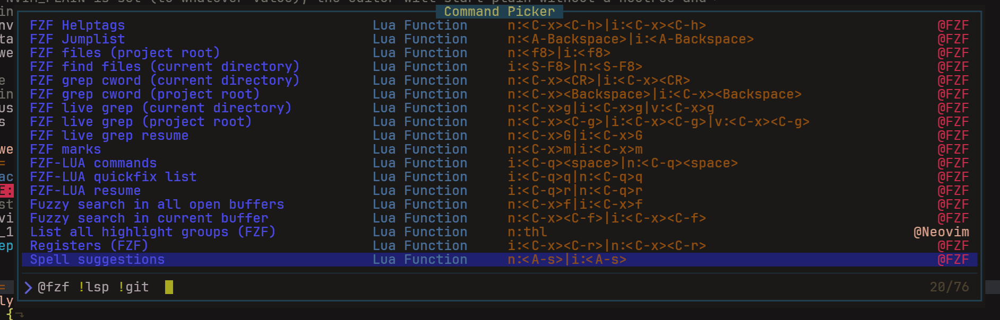

# The Command Palette

The command palette is some sort of popup that will allow you to select from a wide range of commands. 
Each command has a description, belongs to a category and has one or more keyboard shortcuts assigned.

## Here is how it looks
<figure markdown="span">
  
  <figcaption>
The command palette
</figcaption>
</figure>

The command palette is always available via the keyboard shortcut ++alt+p++.

{==

The command palette will be populated once the first file was loaded. Because of the large number of 
commands to process, it would add significant startup time, that's why activation is delayed.

==}
